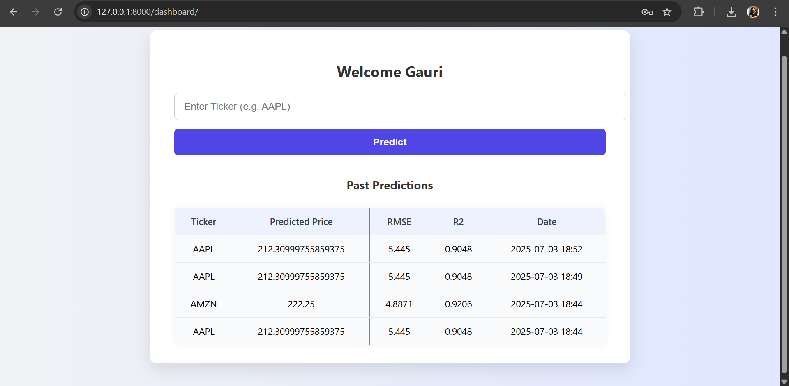

# 📈 Stock Insight -Django Stock Prediction App

Stock Insight is a full-stack Django application that lets users:
- 🔐 Register & login
- 📊 Predict stock prices using a trained ML model
- 💾 View their past predictions
- 📡 Fetch real-time stock data via Yahoo Finance (`yfinance`)

---

## 🚀 Features

- ✅ User authentication (register/login/logout)
- 📈 Predict next-day stock price using historical data
- 💬 ML model integration (Keras/TensorFlow or joblib)
- 💻 REST API (Django REST Framework)
- 🧾 Stores & displays past predictions
- 🎯 CSRF-protected AJAX-based frontend

---

## 📦 Tech Stack

| Layer       | Tech                      |
|-------------|---------------------------|
| Backend     | Django, Django REST Framework |
| Frontend    | HTML, CSS, jQuery, AJAX   |
| ML Model    | TensorFlow / Keras / joblib |
| Data Source | yfinance (Yahoo Finance)  |
| Auth        | Session Auth, CSRF Token  |
| Database    | SQLite (default)          |

---

## ⚙️ Setup Instructions

### 1. Clone the repo

git clone https://github.com/yourusername/stock-insight.git
cd stock-insight

### 2. Create a virtual environment

python -m venv venv
venv\Scripts\activate

### 3. Install dependencies

pip install -r requirements.txt

### 4. Set environment variables (optional .env file)

MODEL_PATH=ml/stock_prediction_model.keras

### 5.  Run migrations

python manage.py migrate

### 6. Run the server

python manage.py runserver

---

Then visit: http://127.0.0.1:8000/

---

# 📡 API Endpoints

/api/v1/predict/	POST	Predict stock price
/api/v1/predictions/	GET	Get user's past predictions
/api/v1/token/	POST	JWT login
/api/v1/token/refresh/	POST	Refresh JWT token

---

# 🧠 How It Works

1. User logs in and enters a stock ticker (e.g., AAPL)

2. The ML model fetches last 1 year of stock data using yfinance

3. Data is preprocessed (scaled), and the model predicts the next price

4. Prediction result (price, RMSE, R2) is saved to DB

---

✅ Sample Tickers to Try

1. AAPL, MSFT, GOOGL, TSLA, META

2. RELIANCE.NS, TCS.NS, INFY.NS, HDFCBANK.NS

Make sure the ticker exists on Yahoo Finance

## Screenshots

To provide a better understanding of the Student Study Portal application, here is a screenshot:

##Home Interface

##Register Interface

##Login Interface

##Dashboard Interface

